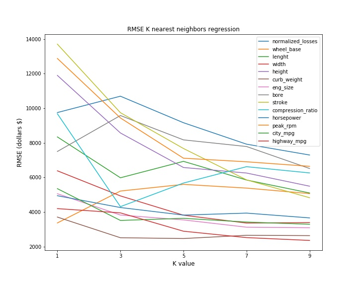
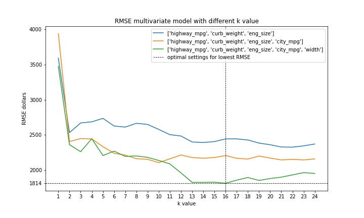

# Predict Car Prices

The model is trained on data from Ebay car sales data and can predict the car price with an approximation as low as 1814$. This value was obtained by applying a multivariate linear regression with 5 features and a k value of 16. 
### Best features for univariate linear regression
 By sampling a few k values on all the numeric features found in the dataset, the 5 that gave the lowest RMSE were:
- highway_mpg 
- curb_weigh
- eng_size 
- city_mpg 
- width

### Find the optimal settings (number of features and k value)
Based on the first graph different combination of the best features were tested for a range of parameters. The couple of setting that gave the lowest RMSE was with 5 features and a k value of 16. 

###Conclusion 
The model can approximate the car price with a deviation of 1814$ which is still quite high. The dataset was quite small and so gathering more data might help to decrease this deviation.
