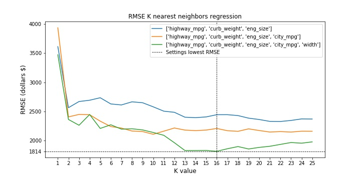

# Predict Car Prices

The model is trained on data from Ebay car sales data and can predict the car price with an approximation as low as 1814$. This value was obtained by a combination of 5 features and a k value of 16. 
### Find the best features
 By sampling a few k values on all the numeric features found in the dataset, the 5 that gave the lowest RMSE were:
- highway_mpg 
- curb_weigh
- eng_size 
- city_mpg 
- width 

### Find the optimal settings (number of features and k value)
Different combination of the best features were tested for a range of parameters and the couple of setting which gave the lowest RMSE was using 5 features and a k value of 16. 

